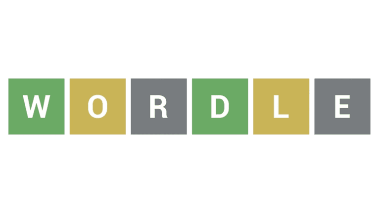

# Wordle the game

## **What is Wordle?**  
Wordle is word puzzle game where the objective is to guess a five-letter word within five attempts.  

## **Why Wordle?**
I wanted to challenge myself by applying what I’ve learned over the past six weeks to develop this game.

## **How to play?**
+ You type in a valid five-letter word as your guess. 

+ The game gives feedback using colored tiles:
    + Green: The letter is correct and in the correct position.
    + Yellow: The letter is in the word but in the wrong position.
    + Red: The letter is not in the word at all.
Based on the feedback, you make more educated guesses until you find the correct word or use all Five tries. 
>***Tips*** You may use the Hint function if you feel stuck.

## Technologies Used
I have used several Tools to develop this game:
+ `HTML`
+ `CSS`
+ `JavaScript`

## *References*
>For more info about Wordle you can [click here](https://en.wikipedia.org/wiki/Wordle)

>you may download the game from [WordleTheGame](https://github.com/ibutaibeh/Wordle)

## What is Next?
+ QoL 
    + using keyboard to Enter words
    + Dark mode
    + BGM shaffle
    + Sound effect
+ Overhaul to the Animarion (winning).
+ add the definition of the word to the Hint Function.
